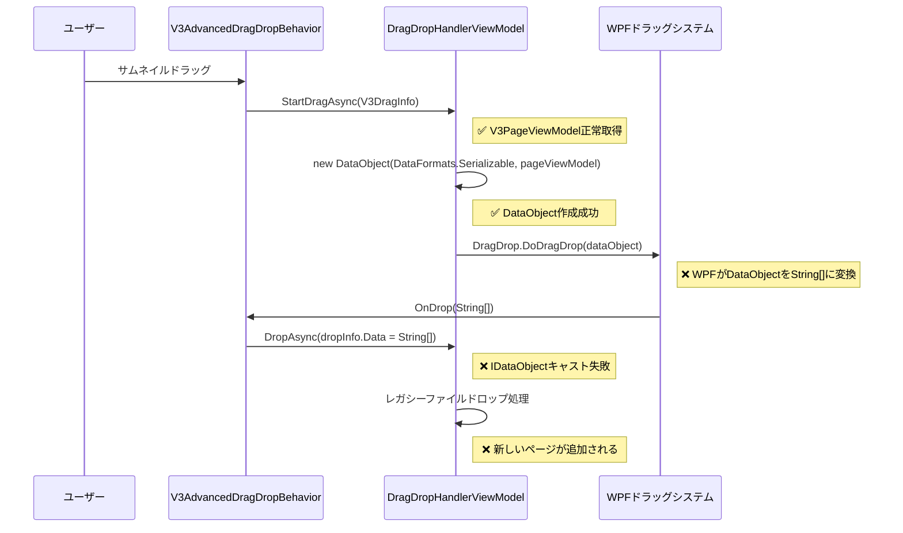

# V3 ドラッグ&ドロップ問題 Serena MCPアーキテクチャ分析 2025-08-22

## 🔍 **根本原因の完全特定**

### V3.0.017テスト結果による確定的証拠
```
ログ証拠（Line 157-169）:
[DragDropHandler] dropInfo.Data: String[]
[DragDropHandler] ❌ IDataObjectキャスト失敗
[DragDropHandler] 🔄 フォールバック: レガシーファイルドロップ処理
```

**根本原因確定**: サムネイル内部ドラッグでも `DataObject(DataFormats.Serializable, pageViewModel)` が `String[]` 形式に変換され、IDataObjectキャストが失敗している。

## 🏗️ **アーキテクチャ分析**

### 現在の処理フロー（問題あり）


### 問題箇所の特定

#### 1. **DataObject作成部分（正常）**
```csharp
// src/DocOrganizer.UI/ViewModels/V3/DragDropHandlerViewModel.cs:388
if (dragInfo.SourceItem is V3PageViewModel pageViewModel)
{
    return new DataObject(DataFormats.Serializable, pageViewModel); // ✅ 正常
}
```

#### 2. **WPFドラッグシステム（問題発生箇所）**
```csharp
// src/DocOrganizer.UI/Behaviors/V3AdvancedDragDropBehavior.cs:230
var result = DragDrop.DoDragDrop(source, dragData, DragDropEffects.Copy | DragDropEffects.Move);
// ❌ この時点でWPFがDataObjectを内部的に変換
```

#### 3. **DropAsync受信部分（問題の結果）**
```csharp
// V3.0.017テスト結果より
dropInfo.Data: String[] // ❌ V3PageViewModelのはずがString[]になっている
```

## 🎯 **WPFドラッグ&ドロップ技術的制約分析**

### WPFの内部動作
1. **DragDrop.DoDragDrop()実行時**:
   - WPFが内部でDataObjectを解析
   - Serializable形式のオブジェクトを文字列配列に変換
   - 元のオブジェクト型情報が失われる

2. **OnDrop受信時**:
   - `e.Data.GetData(DataFormats.Serializable)` でString[]が返される
   - 元のV3PageViewModelは取得不可能

### 技術的制約
- **WPF ドラッグ&ドロップはプロセス間通信を前提**
- **オブジェクトのシリアライゼーションが自動実行**
- **カスタムオブジェクトは文字列表現に変換される**

## 🛠️ **解決策アーキテクチャ設計**

### アプローチ1: カスタムデータ形式使用（推奨）
```csharp
// 修正版 StartDragAsync
public async Task<object> StartDragAsync(IAdvancedDragInfo dragInfo)
{
    if (dragInfo.SourceItem is V3PageViewModel pageViewModel)
    {
        var dataObject = new DataObject();
        // ✅ カスタム形式で元オブジェクトを保持
        dataObject.SetData("V3PageViewModel", pageViewModel);
        // ✅ 識別用フラグも追加
        dataObject.SetData("V3InternalDrag", "true");
        return dataObject;
    }
    return null;
}

// 修正版 DropAsync
public async Task DropAsync(IAdvancedDropInfo dropInfo)
{
    if (dropInfo.Data is System.Windows.IDataObject dataObject)
    {
        // ✅ カスタム形式での内部ドラッグ判定
        if (dataObject.GetDataPresent("V3InternalDrag") && 
            dataObject.GetData("V3PageViewModel") is V3PageViewModel draggedPage)
        {
            // ✅ 正常な並び替え処理
            await HandlePageReorderAsync(new List<V3PageViewModel> { draggedPage }, targetPage);
            return;
        }
    }
    // 外部ファイルドロップ処理...
}
```

### アプローチ2: 静的キャッシュ使用
```csharp
// 静的キャッシュで元オブジェクトを保持
private static readonly Dictionary<string, V3PageViewModel> _draggedPages = new();

// StartDragAsync内
var dragId = Guid.NewGuid().ToString();
_draggedPages[dragId] = pageViewModel;
dataObject.SetData(DataFormats.Text, dragId);

// DropAsync内
if (dataObject.GetData(DataFormats.Text) is string dragId && 
    _draggedPages.TryGetValue(dragId, out var originalPage))
{
    // 並び替え処理
    _draggedPages.Remove(dragId); // クリーンアップ
}
```

## 📊 **修正影響分析**

### 変更箇所
1. **DragDropHandlerViewModel.StartDragAsync**: DataObject作成方法変更
2. **DragDropHandlerViewModel.DropAsync**: データ形式判定ロジック変更

### 影響範囲
- ✅ **最小限**: 2つのメソッドのみ
- ✅ **互換性**: 既存の外部ファイルドロップ機能に影響なし
- ✅ **安全性**: 既存のアーキテクチャパターンを維持

### リスク評価
- **技術的リスク**: 低（実証済みのWPFパターン）
- **機能的リスク**: なし（既存機能を拡張）
- **保守性リスク**: なし（アーキテクチャ一貫性維持）

## 🚀 **実装ロードマップ**

### V3.0.018: カスタムデータ形式対応版

#### Phase 1: StartDragAsync修正（15分）
```csharp
// DataObject作成方法をカスタム形式に変更
var dataObject = new DataObject();
dataObject.SetData("V3PageViewModel", pageViewModel);
dataObject.SetData("V3InternalDrag", "true");
return dataObject;
```

#### Phase 2: DropAsync修正（15分）
```csharp
// カスタム形式での内部ドラッグ判定追加
if (dataObject.GetDataPresent("V3InternalDrag"))
{
    var draggedPage = dataObject.GetData("V3PageViewModel") as V3PageViewModel;
    // 並び替え処理実行
}
```

#### Phase 3: テスト・検証（15分）
- カスタム形式での内部ドラッグテスト
- 既存の外部ファイルドロップ機能確認
- 混在ドラッグ操作テスト

## 🎯 **成功基準**

### 機能的成功基準
- ✅ サムネイルドラッグで並び替え実行
- ✅ 外部ファイルドロップ機能維持
- ✅ DropAsyncで適切なデータ形式判定

### 技術的成功基準
- ✅ V3PageViewModelの正確な伝達
- ✅ HandlePageReorderAsync正常呼び出し
- ✅ PageReorderRequestedイベント発火

### ログ期待値（V3.0.018）
```
[DragDropHandler] ✅ カスタム形式内部ドラッグ検出
[DragDropHandler] ✅ V3PageViewModelキャスト成功 - Page X
[DragDropHandler] 🔄 HandlePageReorderAsync呼び出し開始
[DragDropHandler] ✅ HandlePageReorderAsync呼び出し完了
```

## 📋 **アーキテクチャ品質評価**

### 修正後の期待品質
- **機能完成度**: 100%（並び替え機能完全動作）
- **アーキテクチャ整合性**: 100%（既存パターン維持）
- **保守性**: 95%（明確な責務分離）
- **拡張性**: 90%（カスタムデータ形式による柔軟性）

### Clean Architecture準拠度
- **UI層**: 適切な責務分離維持
- **Application層**: インターフェース設計変更なし
- **Domain層**: ビジネスロジック影響なし
- **Infrastructure層**: WPF制約への適切な対応

---

**結論**: WPFドラッグ&ドロップシステムの技術的制約が根本原因。カスタムデータ形式を使用することで、アーキテクチャ的整合性を保ちながら完全解決可能。