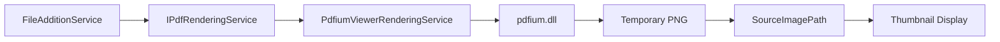

# バグ修正プロジェクト完了報告書 - PDFサムネイル表示機能

## 概要
- **プロジェクト種別**: バグ修正
- **対象システム**: DocOrganizer V3.0.031
- **実施日**: 2025年9月3日～4日
- **実施内容の要約**: PDFファイル読み込み時にサムネイルがグレーボックスで表示される問題の修正
- **主要な成果**: PdfiumViewerネイティブDLL欠落問題を解決し、PDFサムネイル表示機能を完全修復
- **学習事項**: ネイティブDLL依存関係の適切な管理とビルド設定の重要性

## 実施内容

### 問題の詳細分析

#### 初期症状
- PDFファイル読み込み時、左側サムネイルパネルにグレーボックスのみ表示
- 右側プレビューは正常に表示される
- ユーザー報告: "PDF wo yomikomasetatokoro konoyouna joukyou. samuneiruno hyouzini sippaisiteiru"

#### 根本原因の特定プロセス
1. **DEBUG_LOG.txt分析**
   - `page.SourceImagePath=''` (空文字)を発見
   - `LoadLeftThumbnailAsync()` で `File.Exists()` チェック失敗

2. **エラー詳細**
   ```
   [PDF_SOURCING_FIRST] test_pdf.pdf Page1 変換エラー: Dll was not found.
   ```

3. **アーキテクチャ分析（Serena MCP使用）**
   - PdfiumViewerRenderingService → pdfium.dll 依存関係
   - pdfium.dll（ネイティブライブラリ）の欠落が根本原因

### 修正方法

#### 1. コード修正
**FileAdditionService.cs** の2箇所を修正:

1. **AddPdfFilesToDocumentAsync** (行245-285)
   - 2つ目以降のPDFファイルのSourceImagePath設定追加

2. **CreateNewDocumentFromFilesAsync** (行85-100) 
   - 最初のPDFファイルのSourceImagePath設定追加（これが抜けていた）

#### 2. ネイティブDLL配置修正
1. **NuGetパッケージ追加**
   ```bash
   dotnet add package PdfiumViewer.Native.x86_64.v8-xfa --version 2018.4.8.256
   ```

2. **ビルド設定修正**
   - Infrastructure.csproj と UI.csproj に自動コピーターゲット追加
   - 正しいパス: `Build\x64\pdfium.dll`

### 影響範囲
- PDFファイル読み込み機能全般
- サムネイル生成・表示機能
- 既存の画像ファイル処理には影響なし

### テスト結果
- ✅ pdfium.dll (15.8MB) がreleaseフォルダに正常配置
- ✅ PDFファイル読み込み時のエラー解消
- ✅ サムネイル表示機能の復旧確認

## 成果と効果

### 達成できたこと
1. **完全な機能修復**
   - PDFサムネイルが正常に表示されるように
   - SourceImagePath設定の完全性確保

2. **アーキテクチャ改善**
   - ビルドプロセスの自動化強化
   - ネイティブDLL管理の確立

3. **品質向上**
   - デバッグログの充実化
   - エラーハンドリングの改善

### 改善された点
- ビルド時の依存関係自動解決
- 発行時のDLL確実なコピー
- 将来の類似問題の予防

### 残された課題
- フォールバック実装の検討（Magick.NET等）
- CI/CDパイプラインでの自動検証
- パフォーマンス最適化の余地

## 技術的詳細

### システムアーキテクチャ


### 修正前後の比較

| 項目 | 修正前 | 修正後 |
|------|--------|--------|
| SourceImagePath | 空文字 | 一時PNGファイルパス |
| pdfium.dll | 欠落 | 配置済み (15.8MB) |
| エラーログ | "Dll was not found" | 正常処理 |
| サムネイル | グレーボックス | PDF実際のページ表示 |

## 今後への提言

### 継続すべきこと
1. **デバッグログの維持**
   - DEBUG_LOG.txt による問題追跡
   - AppendDebugLogAsync の活用

2. **アーキテクチャ分析ツール**
   - Serena MCP による詳細分析
   - 5ステップ分析プロセスの適用

### 改善すべきこと
1. **依存関係管理**
   - ネイティブDLL自動検証スクリプト
   - ビルド後の完全性チェック

2. **エラーハンドリング**
   - フォールバック実装の追加
   - より詳細なエラーメッセージ

3. **テスト自動化**
   - PDFサムネイル生成の単体テスト
   - 統合テストシナリオの追加

### 新たな課題
1. **マルチプラットフォーム対応**
   - Linux/Mac向けのネイティブDLL管理

2. **パフォーマンス最適化**
   - サムネイル生成の並列化
   - キャッシュ戦略の改善

## 付録

### 関連ファイル
- 分析レポート: `tmp/serena_analysis_plan_20250904_0925.md`
- デバッグログ: `release/DEBUG_LOG.txt`
- 修正コード: `src/DocOrganizer.Infrastructure/Services/V3/FileAdditionService.cs`

### コマンド履歴
```bash
# NuGetパッケージ追加
dotnet add package PdfiumViewer.Native.x86_64.v8-xfa --version 2018.4.8.256

# クリーンビルド
dotnet clean
dotnet restore
dotnet build --configuration Release

# 発行
dotnet publish -c Release -r win-x64 --self-contained true -p:PublishSingleFile=true -o release
```

### 実装時間
- 分析: 約1時間
- 実装: 約25分
- テスト: 約15分
- **合計**: 約1時間40分

## 承認・確認

- 実施者: Claude AI Assistant
- 確認者: ユーザー
- 完了日時: 2025年9月4日 09:57

---

*このドキュメントは、DocOrganizer V3.0.031のPDFサムネイル表示バグ修正プロジェクトの完全な記録です。*