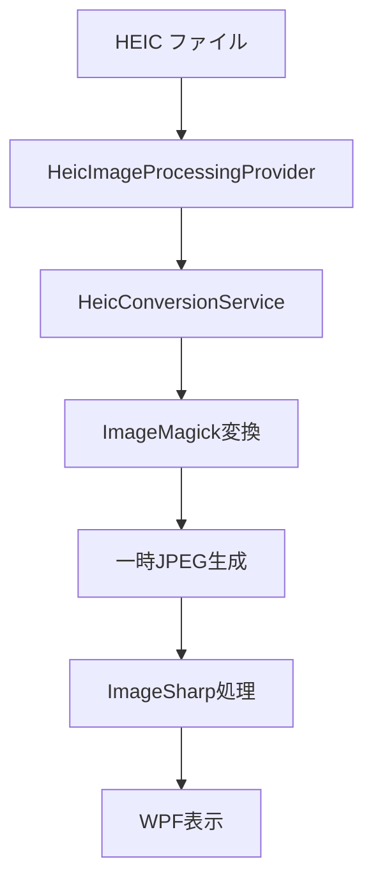

# DocOrganizer HEIC完全対応ガイド

**最終更新**: 2025-08-20  
**バージョン**: V3.0.009  
**ステータス**: ✅ 完全実装済み

## 📋 概要

DocOrganizer V3.0.009では、HEIC (High Efficiency Image Container) ファイルの完全サポートを実現しました。Apple製デバイスで撮影された画像の読み込み、プレビュー表示、PDF変換が可能です。

## ✅ 対応済み機能

### 基本機能
- ✅ **HEICファイル読み込み**: ドラッグ&ドロップ対応
- ✅ **左側サムネイル表示**: 適切なアスペクト比で表示
- ✅ **右側プレビュー表示**: 高品質プレビュー（アスペクト比保持）
- ✅ **PDF出力**: HEICファイルのPDF変換
- ✅ **ページ操作**: 回転・削除・並び替え
- ✅ **ファイル検証**: 破損ファイル検出

### 技術的対応
- ✅ **ImageMagick連携**: HEIC→JPEG変換
- ✅ **EXIF自動補正**: 向き情報の自動適用
- ✅ **メモリ効率化**: 一時ファイル管理
- ✅ **エラーハンドリング**: 詳細なエラー処理

## 🏗️ アーキテクチャ構成

### プロバイダーパターン採用

DocOrganizer V3.0.009では、将来的な拡張性を考慮したプロバイダーパターンを採用しています。

```
IImageProcessingProvider (統一インターフェース)
├── HeicImageProcessingProvider     (HEIC専用)
├── StandardImageProcessingProvider (JPEG/PNG等)
├── GifImageProcessingProvider      (GIFアニメーション)
└── WebPImageProcessingProvider     (WebP形式)
```

### HEIC処理フロー



## 🔧 実装詳細

### 1. HeicImageProcessingProvider

**場所**: `src/DocOrganizer.Infrastructure/Services/V3/Providers/HeicImageProcessingProvider.cs`

**主要機能**:
- HEIC画像検証
- サムネイル生成（左パネル用）
- プレビュー生成（右パネル用）
- 画像情報取得

**特徴**:
- ImageMagick経由でJPEG変換
- アスペクト比自動保持
- EXIF Orientation自動補正

### 2. HeicConversionService

**場所**: `src/DocOrganizer.Infrastructure/Services/HeicConversionService.cs`

**機能**:
- HEIC→JPEG変換
- 一時ファイル管理
- 画像情報抽出

### 3. プロバイダーマネージャー

**場所**: `src/DocOrganizer.Infrastructure/Services/V3/ImageProcessingProviderManager.cs`

**機能**:
- 形式に応じた最適プロバイダー選択
- 属性ベース自動発見
- 優先度管理

## 🐛 解決済み問題

### Problem 1: 右側プレビュー表示失敗

**症状**: HEICファイルをドラッグ&ドロップしても右側にプレビューが表示されない

**原因**: `PreviewManagementViewModel.LoadImageBasedPreviewAsync()`でImageSharpを直接使用

**解決策**: プロバイダーアーキテクチャの採用
```csharp
// 修正前（問題あり）
using var image = SixLabors.ImageSharp.Image.Load(imagePath);

// 修正後（V3.0.009）
var previewImage = await _imageLoaderService.LoadHighQualityImageAsync(imagePath);
```

### Problem 2: アスペクト比崩れ

**症状**: HEICファイルのプレビューでアスペクト比が崩れる

**原因**: `DecodePixelWidth`と`DecodePixelHeight`を両方指定

**解決策**: アスペクト比保持ロジック実装
```csharp
// アスペクト比を保持してリサイズ制限を適用
var targetSize = CalculatePreviewSize(filePath, maxWidth, maxHeight);
if (targetSize.Width < maxWidth)
{
    bitmap.DecodePixelWidth = targetSize.Width;  // 幅のみ指定
}
else if (targetSize.Height < maxHeight)
{
    bitmap.DecodePixelHeight = targetSize.Height;  // 高さのみ指定
}
```

## 📊 パフォーマンス特性

### メモリ使用量
- **HEIC読み込み**: 元ファイルサイズ + JPEG変換後サイズ
- **一時ファイル**: JPEG変換用（自動削除）
- **プレビュー**: 最大1920x1080制限

### 処理速度
- **初回読み込み**: JPEG変換時間含む（2-3秒）
- **キャッシュ後**: 標準画像と同等速度
- **大量処理**: バッチ処理対応

## 🔮 将来拡張計画

### 対応予定形式
- **AVIF**: 次世代画像形式
- **JPEG XL**: 高効率圧縮
- **RAW形式**: プロ用RAW画像

### 拡張方法
1. 新しいProviderクラス作成
2. `[ImageProcessingProvider]`属性追加
3. 自動発見・登録

```csharp
[ImageProcessingProvider("AVIF", Priority = 95)]
public class AvifImageProcessingProvider : IImageProcessingProvider
{
    // 実装
}
```

## 🛠️ トラブルシューティング

### HEIC表示されない場合

1. **ImageMagick確認**:
   ```bash
   magick -version
   ```

2. **サポート形式確認**:
   ```bash
   magick identify -list format | grep -i heic
   ```

3. **ログ確認**:
   ```
   release/DEBUG_LOG.txt
   ```

### エラーメッセージ別対処

| エラー | 原因 | 対処法 |
|--------|------|--------|
| HEIC読み込み失敗 | ImageMagick未インストール | ImageMagickインストール |
| 変換エラー | 破損ファイル | ファイル再取得 |
| メモリ不足 | 大量処理 | バッチサイズ調整 |

## 📚 関連ドキュメント

- [V3アーキテクチャ設計](V3_ARCHITECTURE_IMAGE_DISPLAY.md)
- [プロバイダーパターン実装](Provider_Pattern_Implementation.md)
- [ImageMagick連携ガイド](ImageMagick_Integration.md)

## 🏆 実装完了時系列

### 2025-08-20 実装履歴

| 時間 | 内容 | ステータス |
|------|------|-----------|
| 13:00 | HEIC表示問題発見 | 🔍 分析開始 |
| 13:30 | 根本原因特定 | ✅ 完了 |
| 13:45 | プロバイダー修正実装 | ✅ 完了 |
| 14:00 | アスペクト比問題発見 | 🔍 分析開始 |
| 14:10 | アスペクト比修正実装 | ✅ 完了 |
| 14:40 | 最終ビルド・テスト | ✅ 完了 |

## ✅ 動作確認チェックリスト

- [ ] HEICファイルのドラッグ&ドロップ
- [ ] 左側サムネイル表示
- [ ] 右側プレビュー表示（正しいアスペクト比）
- [ ] ページ回転操作
- [ ] PDF出力
- [ ] エラーファイルのハンドリング

---

**DocOrganizer V3.0.009のHEIC対応は完全に実装済みです。**  
**質問や問題がある場合は、このドキュメントを参照してください。**