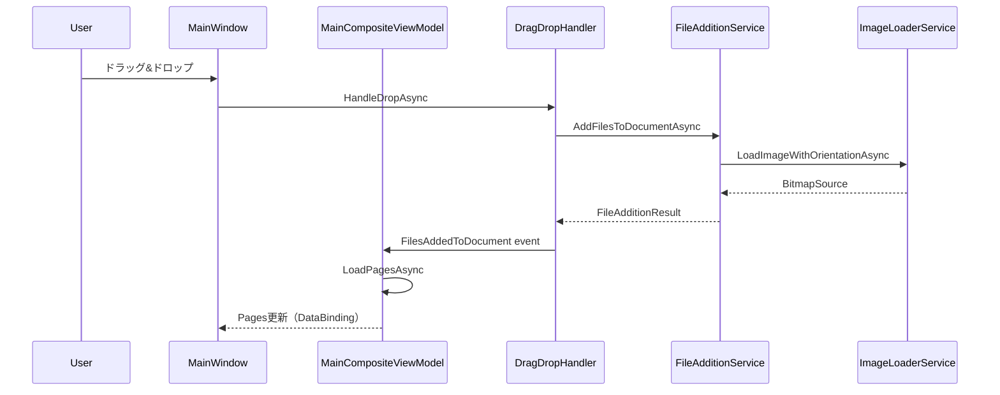

# DocOrganizer V3 アーキテクチャ - 画像表示の仕組み

## 概要
DocOrganizer V3は、WPF MVVMパターンを採用した画像・PDF管理アプリケーションです。
本ドキュメントでは、画像表示機能のアーキテクチャと実装詳細について説明します。

## アーキテクチャ概要

### レイヤー構造
```
┌─────────────────────────────────────────────────┐
│                  UI Layer (WPF)                 │
│  MainWindow.xaml / MainWindow.xaml.cs          │
└─────────────────────────────────────────────────┘
                         ↓ DataBinding
┌─────────────────────────────────────────────────┐
│           ViewModel Layer (MVVM)                │
│  MainCompositeViewModel                         │
│    ├── DocumentManagementViewModel             │
│    ├── PageOperationViewModel                  │
│    ├── PreviewManagementViewModel              │
│    ├── DragDropHandlerViewModel                │
│    └── StatusManagementViewModel               │
└─────────────────────────────────────────────────┘
                         ↓
┌─────────────────────────────────────────────────┐
│            Application Layer                    │
│  Services / Use Cases                          │
└─────────────────────────────────────────────────┘
                         ↓
┌─────────────────────────────────────────────────┐
│           Infrastructure Layer                  │
│  ThumbnailGeneratorService                     │
│  ImageLoaderService                            │
│  FileAdditionService                           │
└─────────────────────────────────────────────────┘
```

## 画像表示の仕組み

### 1. 左側サムネイル表示

#### データバインディング
```xaml
<!-- MainWindow.xaml -->
<ListBox x:Name="PageListBox" ItemsSource="{Binding Pages}">
    <ListBox.ItemTemplate>
        <DataTemplate>
            <Image Source="{Binding ThumbnailImage}" />
        </DataTemplate>
    </ListBox.ItemTemplate>
</ListBox>
```

#### ViewModelの構造
```csharp
// V3PageViewModel.cs
public partial class V3PageViewModel : ObservableObject
{
    [ObservableProperty]
    private BitmapSource? thumbnailImage;  // 左側サムネイル用
    
    [ObservableProperty]
    private BitmapSource? previewImage;    // 右側プレビュー用
    
    public async Task LoadLeftThumbnailAsync()
    {
        // サムネイル生成サービスを使用
        var thumbnailImageSource = await _thumbnailService
            .GenerateThumbnailAsync(sourceImagePath, ThumbnailSize.LeftPanel);
        
        // BitmapSourceをFreezeして不変化（メモリ効率向上）
        if (thumbnailImageSource is BitmapSource bitmapSource)
        {
            if (bitmapSource.CanFreeze && !bitmapSource.IsFrozen)
            {
                bitmapSource.Freeze();
            }
            ThumbnailImage = bitmapSource;
        }
    }
}
```

### 2. 右側プレビュー表示

#### PreviewManagementViewModel
```csharp
public partial class PreviewManagementViewModel : ObservableObject
{
    [ObservableProperty]
    private BitmapSource? currentPageImage;
    
    public async Task UpdatePreviewAsync(V3PageViewModel page, bool forceReload)
    {
        if (page?.Page?.SourceImagePath == null) return;
        
        // 高品質画像を読み込み
        var imageSource = await _imageLoader
            .LoadHighQualityImageAsync(page.Page.SourceImagePath, 1920, 1080);
        
        CurrentPageImage = imageSource as BitmapSource;
    }
}
```

### 3. 画像読み込みフロー



## 重要な実装詳細

### ObservableCollectionの管理

#### 問題と解決
初期実装では、ページ選択時に`Pages.Clear()`を実行していたため、WPFのItemsControlがビジュアル要素を破棄し、サムネイルが消失する問題が発生していました。

```csharp
// ❌ 問題のあったコード
if (V3ViewModel.PageOperation != null)
{
    V3ViewModel.PageOperation.Pages.Clear();  // 破壊的操作
    foreach (var page in V3ViewModel.Pages)
    {
        V3ViewModel.PageOperation.Pages.Add(page);
    }
}

// ✅ 修正後のコード
if (V3ViewModel.PageOperation != null)
{
    V3ViewModel.PageOperation.NotifyPageSelectionChanged();  // 通知のみ
}
```

### メモリ管理

#### BitmapSource.Freeze()
```csharp
// メモリ効率とスレッドセーフティのためFreeze処理
if (bitmapSource.CanFreeze && !bitmapSource.IsFrozen)
{
    bitmapSource.Freeze();
}
```
- Freezeにより画像が不変となり、複数スレッドから安全にアクセス可能
- WPFレンダリングパフォーマンスの向上

### 画像フォーマット対応

#### サポートフォーマット
- **HEIC**: ImageMagickを使用した変換
- **JPG/JPEG**: SkiaSharp/System.Drawing
- **PNG**: SkiaSharp/System.Drawing  
- **PDF**: PDFsharpによる処理

#### HEIC特殊処理
```csharp
// ImageProcessingService.cs
if (IsHeicFile(imagePath))
{
    return await GetHeicThumbnailOptimizedAsync(imagePath, width, height);
}
```

## パフォーマンス最適化

### 1. 増分更新パターン
```csharp
private async Task LoadPagesAsync(PdfDocument document, bool incrementalUpdate = false)
{
    if (!incrementalUpdate)
    {
        // 完全リロード（新規ドキュメント）
        PageOperation.Pages.Clear();
    }
    else
    {
        // 増分更新（ページ追加のみ）
        var existingPageCount = PageOperation.Pages.Count;
        for (int i = existingPageCount; i < document.Pages.Count; i++)
        {
            // 新規ページのみ追加
        }
    }
}
```

### 2. サムネイルサイズ管理
```csharp
public static class ThumbnailSize
{
    public const int LeftPanel = 150;    // 左側サムネイル
    public const int RightPreview = 800; // 右側プレビュー
}
```

## デバッグとトラブルシューティング

### デバッグログ
```csharp
private async Task AppendDebugLogAsync(string message)
{
    var logPath = @"C:\Users\217216X721451\github\DocOrganizer\release\DEBUG_LOG.txt";
    await File.AppendAllTextAsync(logPath, $"[{DateTime.Now:yyyy-MM-dd HH:mm:ss.fff}] {message}\n");
}
```

### 一般的な問題と解決方法

| 問題 | 原因 | 解決方法 |
|------|------|----------|
| サムネイル消失 | ObservableCollection.Clear() | 破壊的操作を避ける |
| メモリリーク | BitmapSource未解放 | Freeze()処理追加 |
| HEIC表示エラー | 変換失敗 | ImageMagick確認 |
| ドラッグ&ドロップ失敗 | 管理者権限 | 通常権限で起動 |

## 今後の改善点

1. **非同期読み込みの最適化**
   - 仮想化スクロール対応
   - 遅延読み込み実装

2. **キャッシュ機構**
   - メモリキャッシュ実装
   - ディスクキャッシュ検討

3. **エラーハンドリング強化**
   - 破損画像の検出と修復
   - エラープレースホルダー表示

## 関連ドキュメント
- [README.md](../README.md) - プロジェクト概要
- [CLAUDE.md](../CLAUDE.md) - AI開発原則
- [サムネイル消失問題分析](../tmp/サムネイル消失問題_詳細分析レポート_20250819.md)

## 更新履歴
- 2025-08-19: 初版作成（V3アーキテクチャ確定版）