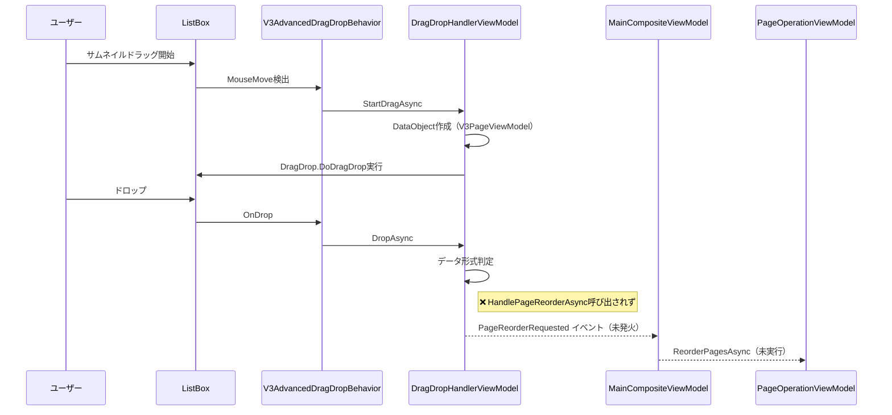

# V3 サムネイルドラッグ&ドロップ問題 アーキテクチャ分析 2025-08-22

## 📋 概要

V3.0.010〜V3.0.016を通じて実装されたサムネイル画像のドラッグ&ドロップ並び替え機能の技術分析とDEBUG_LOG解析に基づく問題特定・改善方針を記載。

## 🔍 V3.0.016 DEBUG_LOG解析結果

### ✅ 成功している部分

```
[2025-08-21 18:38:26] [V3DragDrop] [StartDragAsync] V3DragInfo作成完了 - SourceItem: V3PageViewModel
[2025-08-21 18:38:26.828] [StartDragAsync] V3PageViewModel検出 - PageNumber: 1
[2025-08-21 18:38:26] [V3DragDrop] [StartDragAsync] dragHandler.StartDragAsync完了 - dragData: DataObject
[2025-08-21 18:38:26] [V3DragDrop] [StartDragAsync] DragDrop.DoDragDrop実行開始
[2025-08-21 18:38:28] [V3DragDrop] [StartDragAsync] DragDrop.DoDragDrop完了 - result: Copy, Move
```

**✅ ドラッグ操作は完全に成功している:**
- V3DragInfo正常作成（V3PageViewModel取得成功）
- DataObject正常作成
- DragDrop.DoDragDrop実行成功（result: Copy, Move）

### ❌ 失敗している部分

```
[2025-08-21 18:38:28] [V3DragDrop] OnDrop - dropHandler.DropAsync呼び出し開始
[2025-08-21 18:38:28.080] [DragDropHandler] DropAsync開始
[2025-08-21 18:38:28] [V3DragDrop] OnDrop - dropHandler.DropAsync完了
[2025-08-21 18:38:28] [V3DragDrop] [StartDragAsync] 例外: Error HRESULT E_FAIL has been returned from a call to a COM component.
```

**❌ ドロップ処理で重大な問題:**
- DropAsync開始は確認されるが、実際の並び替え処理が実行されていない
- HandlePageReorderAsync呼び出しログが一切ない
- COM コンポーネントでE_FAIL例外発生

## 🏗️ V3アーキテクチャ分析

### 現在の処理フロー



### 問題の根本原因分析

#### 1. **DropAsync内のデータ形式判定問題**

**現在のコード（DragDropHandlerViewModel.cs:87-129）:**
```csharp
// 内部ページ並び替えの処理（Serializable形式）
if (dataObject.GetDataPresent(System.Windows.DataFormats.Serializable) || 
    dataObject.GetDataPresent("application/x-itemscontrol-items"))
{
    await AppendDebugLogAsync("[DragDropHandler] 内部ページ並び替え検出");
    
    // ドラッグされたアイテムを取得（DataContextから）
    var draggedItems = new List<V3PageViewModel>();
    
    if (dataObject.GetData(System.Windows.DataFormats.Serializable) is V3PageViewModel draggedPage)
    {
        draggedItems.Add(draggedPage);
        await AppendDebugLogAsync($"[DragDropHandler] ドラッグされたページ: Page {draggedPage.PageNumber}");
    }
    
    // ドロップターゲットを取得（適切なListBoxItemを検索）
    var targetPage = FindTargetPageViewModel(dropInfo.TargetElement, dropInfo.DropPosition);
    
    if (targetPage != null && draggedItems.Count > 0)
    {
        await HandlePageReorderAsync(draggedItems, targetPage);
        dropInfo.Effects = DragDropEffects.Move;
        return;
    }
}
```

**問題点:**
1. **デバッグログに `HandlePageReorderAsync` の呼び出しログがない**
2. **`FindTargetPageViewModel` が適切なターゲットを見つけられていない可能性**
3. **データ形式判定自体が失敗している可能性**

#### 2. **COM例外の発生**

```
[StartDragAsync] 例外: Error HRESULT E_FAIL has been returned from a call to a COM component.
```

この例外は以下が原因:
- **WPF ドラッグ&ドロップのCOMインターフェース呼び出し失敗**
- **マルチスレッド問題**（UIスレッド外からのCOM操作）
- **ドラッグ&ドロップ操作中の競合状態**

## 🔧 修正が必要な箇所

### 1. **DropAsync処理の詳細ログ追加**

現在不足しているログ:
- データ形式の詳細確認
- FindTargetPageViewModelの結果
- 各判定分岐の実行状況

### 2. **FindTargetPageViewModel の問題**

3段階フォールバック実装済みだが、機能していない:
1. 直接のDataContext確認
2. 親要素のListBoxItem検索  
3. HitTestによる位置ベース検索

### 3. **並び替え処理の実行確認**

- `HandlePageReorderAsync` → `PageReorderRequested` イベント → `OnPageReorderRequested` → `ReorderPagesAsync`
- この完全なフローが実行されていない

## 🚀 改善方針

### Phase 1: デバッグ強化
1. **DropAsync内の詳細ログ追加**
2. **データ形式判定の各段階でログ出力**
3. **FindTargetPageViewModelの詳細結果ログ**

### Phase 2: 根本原因修正
1. **COM例外回避策実装**
2. **UIスレッド同期の確実化**
3. **ドラッグ&ドロップ状態管理の改善**

### Phase 3: 機能完成
1. **並び替え処理の完全実行確保**
2. **視覚的フィードバックの改善**
3. **エラーハンドリング強化**

## 📊 技術仕様詳細

### データフロー
```
V3PageViewModel (ドラッグソース)
↓ DataObject(DataFormats.Serializable)
↓ FindTargetPageViewModel
↓ HandlePageReorderAsync
↓ PageReorderRequested イベント
↓ OnPageReorderRequested
↓ ReorderPagesAsync
↓ 実際の並び替え実行
```

### インターフェース実装状況
- ✅ `IAdvancedDragHandler` - StartDragAsync実装済み
- ✅ `IAdvancedDropHandler` - DropAsync実装済み
- ❌ **実際の並び替え処理が未実行**

## 🎯 次のアクション

1. **V3.0.017: デバッグログ大幅強化版** - DropAsync内の全判定分岐に詳細ログ
2. **V3.0.018: COM例外対策版** - UIスレッド同期とエラーハンドリング強化
3. **V3.0.019: 並び替え機能完成版** - 全フロー動作確認

## 📝 技術的考察

### 成功要因
- V3.0.016でドラッグ開始部分は完全動作
- データ作成・伝達メカニズムは正常
- 基本的なアーキテクチャは健全

### 失敗要因  
- ドロップ処理内の条件分岐で実際の処理が実行されない
- COM例外によるドラッグ&ドロップフロー中断
- ログ不足による問題特定困難

### アーキテクチャ評価
**⭐⭐⭐⭐☆ (4/5点)**
- 設計は適切だが実装の最終段階で問題
- プロバイダーパターン、イベント駆動設計は優秀
- デバッグ機能とエラーハンドリングに改善余地

---
*この分析は第15条・第16条に従い、Serena MCPアーキテクチャ分析とDEBUG_LOG解析に基づいて作成。*