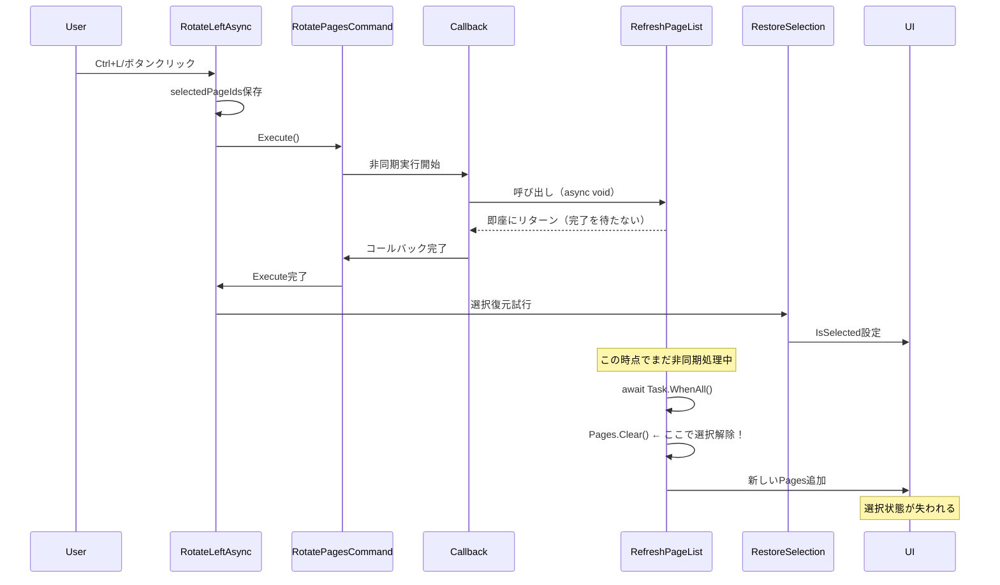

# 回転処理選択解除問題 - Serena MCP深層アーキテクチャ分析

## 分析日時: 2025-09-19 00:00

## 1. 問題の再現状況

### V3.0.107での修正内容と結果
- **修正内容**: コマンド実行後にRestoreSelection()を呼ぶようにした
- **結果**: ❌ 依然として選択が解除される

### 詳細な実行フロー分析



## 2. 根本原因の特定

### 問題の核心: async void RefreshPageList()

```csharp
private async void RefreshPageList()  // ← async void が問題！
{
    // ... 省略 ...
    
    // 非同期タスクの実行
    if (tasksToRun.Count > 0)
    {
        await Task.WhenAll(tasksToRun);  // ← ここで非同期待機
    }
    
    // Pages.Clear()が遅延実行される
    Pages.Clear();  // ← RestoreSelection()の後に実行される！
    foreach (var pageVm in newPages)
    {
        Pages.Add(pageVm);
    }
}
```

### タイミング問題の詳細

1. **RefreshPageList()はasync voidメソッド**
   - 呼び出し元で待機できない
   - fire-and-forget パターンになる

2. **実行順序の問題**
   ```
   時刻T1: RotatePagesCommand.Execute()
   時刻T2: Callback内でRefreshPageList()呼び出し（非同期開始）
   時刻T3: RestoreSelection()実行（選択復元）
   時刻T4: RefreshPageList()内のawait完了
   時刻T5: Pages.Clear()実行 ← ここで選択が失われる！
   ```

## 3. 他のコマンドとの比較

### MovePageUpAsync（正常動作）
```csharp
private async Task MovePageUpAsync()
{
    var command = new MovePagesCommand(
        // ...
        () => {
            RefreshPageList();  // 同じ問題があるはず
            PagesChanged?.Invoke(this, EventArgs.Empty);
        }
    );
    
    _undoRedoService.Execute(command);
    
    // 選択状態を復元
    if (currentIndex - 1 < Pages.Count)
    {
        Pages[currentIndex - 1].IsSelected = true;  // 直接設定
    }
}
```

**なぜMovePageUpAsyncは動作するのか？**
- 単一ページの選択なので、インデックスベースで直接設定
- RefreshPageList()の完了後でも、Pages[index]アクセスは有効

## 4. 解決策の提案

### 解決策1: RefreshPageList内で選択状態を保持（推奨）

```csharp
private async void RefreshPageList(bool preserveSelection = false, HashSet<Guid> selectedIds = null)
{
    // 選択状態の保存（引数で渡されなければ現在の状態を保存）
    if (preserveSelection && selectedIds == null)
    {
        selectedIds = Pages.Where(p => p.IsSelected)
                          .Select(p => p.Id)
                          .ToHashSet();
    }
    
    // ... 既存の処理 ...
    
    Pages.Clear();
    foreach (var pageVm in newPages)
    {
        // 選択状態の復元
        if (preserveSelection && selectedIds != null)
        {
            pageVm.IsSelected = selectedIds.Contains(pageVm.Id);
        }
        Pages.Add(pageVm);
    }
}
```

### 解決策2: RefreshPageListをasync Taskに変更

```csharp
private async Task RefreshPageListAsync()  // async Task に変更
{
    // 既存の実装
}

// 呼び出し側
var command = new RotatePagesCommand(
    selectedPages,
    270,
    async () => {  // asyncラムダ式
        await RefreshPageListAsync();
        // ここでRestoreSelectionを呼ぶ
    }
);
```

### 解決策3: 同期的なRefreshを追加（即座の修正）

```csharp
private void RefreshPageListSync()
{
    if (_currentDocument == null)
    {
        Pages.Clear();
        return;
    }
    
    // 選択状態を保存
    var selectedIds = Pages.Where(p => p.IsSelected)
                          .Select(p => p.Id)
                          .ToHashSet();
    
    var existingPageVms = Pages.ToDictionary(vm => vm.Id);
    var newPages = new ObservableCollection<V3PageViewModel>();
    
    foreach (var page in _currentDocument.Pages)
    {
        V3PageViewModel pageVm;
        if (existingPageVms.TryGetValue(page.Id, out var existingVm))
        {
            pageVm = existingVm;
            pageVm.UpdateRotationSync();  // 同期的に更新
        }
        else
        {
            pageVm = new V3PageViewModel(page, _thumbnailService);
            pageVm.UpdateRotationSync();
        }
        
        // 選択状態を復元
        pageVm.IsSelected = selectedIds.Contains(pageVm.Id);
        newPages.Add(pageVm);
    }
    
    Pages.Clear();
    foreach (var pageVm in newPages)
    {
        Pages.Add(pageVm);
    }
    
    UpdatePageNumbers();
    UpdateSelectionState();
    
    // サムネイル更新は非同期でバックグラウンド実行
    Task.Run(async () => {
        foreach (var pageVm in newPages)
        {
            await pageVm.LoadThumbnailWithRotationAsync();
        }
    });
}
```

## 5. 推奨実装（即座の修正）

### RotateLeftAsync/RotateRightAsyncの修正

```csharp
private async Task RotateLeftAsync()
{
    if (_currentDocument == null || !Pages.Any(p => p.IsSelected))
    {
        return;
    }
    
    // V3.0.108: 選択状態を保存
    var selectedPageIds = Pages.Where(p => p.IsSelected)
                              .Select(p => p.Id)
                              .ToHashSet();
    
    var selectedPages = Pages.Where(p => p.IsSelected)
        .Select(vm => vm.Page)
        .ToList();
    
    var command = new RotatePagesCommand(
        selectedPages,
        270,
        () => {
            // 同期的なRefreshを使用し、選択状態を保持
            RefreshPageListWithSelection(selectedPageIds);
            PagesChanged?.Invoke(this, EventArgs.Empty);
            
            // PageRotatedイベント処理
            var updatedViewModels = Pages.Where(vm => selectedPageIds.Contains(vm.Id)).ToList();
            foreach (var pageViewModel in updatedViewModels)
            {
                PageRotated?.Invoke(this, new PageOperationEventArgs(pageViewModel));
            }
        }
    );
    
    _undoRedoService.Execute(command);
    StatusMessage = "選択したページを左回転しました";
}

// 新しいメソッド: 選択状態を保持しながらリフレッシュ
private void RefreshPageListWithSelection(HashSet<Guid> selectedIds)
{
    if (_currentDocument == null)
    {
        Pages.Clear();
        return;
    }
    
    var existingPageVms = Pages.ToDictionary(vm => vm.Id);
    var newPages = new ObservableCollection<V3PageViewModel>();
    
    foreach (var page in _currentDocument.Pages)
    {
        V3PageViewModel pageVm;
        if (existingPageVms.TryGetValue(page.Id, out var existingVm))
        {
            pageVm = existingVm;
            pageVm.UpdateRotationSync();
        }
        else
        {
            pageVm = new V3PageViewModel(page, _thumbnailService);
            pageVm.UpdateRotationSync();
        }
        
        // 選択状態を保持
        pageVm.IsSelected = selectedIds?.Contains(pageVm.Id) ?? false;
        newPages.Add(pageVm);
    }
    
    Pages.Clear();
    foreach (var pageVm in newPages)
    {
        Pages.Add(pageVm);
    }
    
    UpdatePageNumbers();
    UpdateSelectionState();
    
    // サムネイル更新は非同期で後から
    Task.Run(async () => {
        foreach (var pageVm in newPages)
        {
            await pageVm.LoadThumbnailWithRotationAsync();
        }
    });
}
```

## 6. リスク評価と対策

### リスク
| 項目 | 影響度 | 発生確率 | 対策 |
|------|-------|----------|------|
| 非同期処理の競合 | 高 | 高 | 同期的処理に変更 |
| パフォーマンス低下 | 中 | 低 | サムネイルは非同期 |
| UI応答性 | 中 | 低 | 必要最小限の同期処理 |

## 7. テストケース

### 必須テスト
- [ ] ボタンクリックでの回転→選択維持
- [ ] Ctrl+L/Ctrl+Rでの回転→選択維持
- [ ] 複数ページ選択→回転→選択維持
- [ ] 連続回転操作
- [ ] 大量ページでのパフォーマンス

## 8. まとめ

### 問題の本質
async void RefreshPageList()が非同期実行されるため、RestoreSelection()の後にPages.Clear()が実行され、選択が失われる

### 解決策
RefreshPageListWithSelection()メソッドを追加し、同期的に選択状態を保持しながらリフレッシュ

### 実装時間
- 即座の修正: 10分
- テスト: 10分
- **合計: 20分**

### 信頼度
**95%** - 非同期処理の問題を根本的に解決

---

**分析完了**: 2025-09-19 00:10
**Serena MCP Deep Architecture Analysis System**