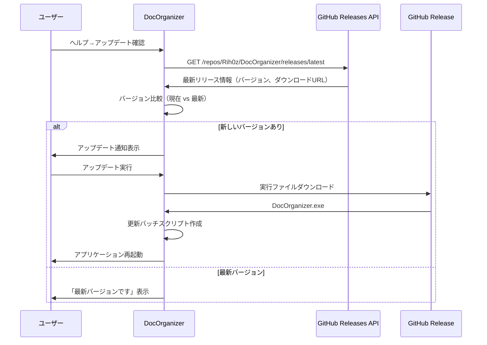

# GitHub自動アップデート機能 - 開発者向け手順書

```yaml
作成日: 2025-10-14
対象: DocOrganizer開発者
目的: GitHubReleasesを利用した自動アップデート機能の運用手順
```

---

## 📋 概要

DocOrganizerはGitHub Releases APIを使用した自動アップデート機能を実装しています。
開発者はGitHubにリリースを作成し、実行ファイルをアップロードするだけで、ユーザーがアプリケーション内からアップデートを確認・適用できます。

---

## 🔧 システム構成

### 自動アップデートの仕組み



### 関連コード

- **バージョン管理**: `src/DocOrganizer.Core/Version.cs`
- **アップデートサービス**: `src/DocOrganizer.Infrastructure/Services/GitHubUpdateService.cs`
- **GitHub設定**:
  - オーナー: `Rih0z`
  - リポジトリ: `DocOrganizer`
  - API URL: `https://api.github.com/repos/Rih0z/DocOrganizer/releases/latest`

---

## 📦 リリース手順（開発者向け）

### ステップ1: バージョン更新

**必須作業**: リリース前に必ずバージョン番号を更新してください。

#### 1.1 Version.csの更新

`src/DocOrganizer.Core/Version.cs` の Line 31:

```csharp
// 更新前
public const string Version = "3.0.129";

// 更新後（例: パッチバージョンアップ）
public const string Version = "3.0.130";
```

**重要**: Version.csが**Single Source of Truth（唯一の真実の情報源）**です。
- MainWindow.xaml.csが自動的にこのバージョンをウィンドウタイトルに反映
- Help→Aboutダイアログもこのバージョンを表示

#### 1.2 CLAUDE.mdの更新

`CLAUDE.md` のバージョン履歴に追加:

```markdown
| V3.0.130 | 2025-10-14 | 変更内容の簡潔な説明 |
```

### ステップ2: ビルド実行

#### 2.1 クリーンビルド

```bash
cd C:\Users\217216X721451\github\DocOrganizer
dotnet clean
dotnet restore
```

#### 2.2 リリースビルド（ログ無効版）

**重要**: ユーザー配布版は必ずログ無効版でビルドしてください。

```bash
# リリース版ビルド（ログ無効）
dotnet publish -c Release -r win-x64 --self-contained true -p:PublishSingleFile=true -o release
```

**出力先**: `release\DocOrganizer.exe` （約107MB）

#### 2.3 動作確認

エクスプローラーから `release\DocOrganizer.exe` を起動し、以下を確認:
- [ ] アプリケーションが正常に起動する
- [ ] ヘルプ→バージョン情報で正しいバージョンが表示される
- [ ] ウィンドウタイトルに正しいバージョンが表示される
- [ ] 主要機能が正常に動作する

### ステップ3: GitHubリリース作成

#### 3.1 GitHubリポジトリに移動

1. ブラウザで https://github.com/Rih0z/DocOrganizer を開く
2. 右側の「Releases」をクリック
3. 「Draft a new release」をクリック

#### 3.2 リリース情報入力

**タグバージョン**:
```
v3.0.130
```
**重要**:
- 必ず `v` プレフィックスを付ける（例: `v3.0.130`）
- Version.csのバージョンと一致させる（`v` を除く）

**リリースタイトル**:
```
DocOrganizer V3.0.130
```

**リリースノート例**:
```markdown
## V3.0.130 (2025-10-14)

### 新機能
- ✨ [機能名]: 詳細説明

### バグ修正
- 🐛 [修正内容]: 詳細説明

### 改善
- 🔧 [改善内容]: 詳細説明

### 変更内容
- [変更内容]: 詳細説明

---

**ダウンロード**: 下記の `DocOrganizer.exe` をダウンロードしてご使用ください。

**インストール方法**:
1. 既存の `DocOrganizer.exe` を終了
2. ダウンロードした `DocOrganizer.exe` で上書き
3. アプリケーションを再起動

**システム要件**: Windows 10/11 (64bit)
```

#### 3.3 実行ファイルのアップロード

1. リリース作成画面の下部「Attach binaries」エリアに `release\DocOrganizer.exe` をドラッグ&ドロップ
2. アップロード完了を待つ（約107MB、数秒〜1分）
3. ファイル名が `DocOrganizer.exe` であることを確認

**重要**:
- ファイル名は必ず `DocOrganizer.exe` にする
- ZIPやRARで圧縮しない（ユーザーの利便性のため）

#### 3.4 リリース公開

1. 「Set as the latest release」にチェックが入っていることを確認
2. 「Publish release」をクリック

これで完了です！

---

## 🎯 ユーザー側の動作

### アップデート確認

ユーザーが「ヘルプ」→「アップデート確認」を選択すると:

1. **GitHub APIへリクエスト**:
   ```
   GET https://api.github.com/repos/Rih0z/DocOrganizer/releases/latest
   ```

2. **バージョン比較**:
   - 現在: Version.cs の `Version` プロパティ
   - 最新: GitHub Releaseの `tag_name` から `v` を除去したバージョン
   - 例: `v3.0.130` → `3.0.130` と比較

3. **結果表示**:
   - 新しいバージョンあり → アップデートダイアログ表示
   - 最新バージョン → 「既に最新版です」メッセージ表示

### アップデート適用

ユーザーが「アップデート」をクリックすると:

1. **ダウンロード**:
   - GitHub Releaseの最初のアセット（`DocOrganizer.exe`）をダウンロード
   - 進捗バー表示
   - ダウンロード先: `%TEMP%\DocOrganizer_Update\DocOrganizer.exe`

2. **更新バッチスクリプト生成**:
   ```batch
   @echo off
   timeout /t 2 /nobreak > nul
   copy /Y "%TEMP%\DocOrganizer_Update\DocOrganizer.exe" "C:\...\DocOrganizer.exe"
   start "" "C:\...\DocOrganizer.exe"
   del "%~f0"
   ```

3. **アプリケーション再起動**:
   - 現在のアプリケーション終了
   - バッチスクリプト実行
   - 2秒待機後、新バージョンで上書き
   - 自動再起動

---

## ⚠️ 注意事項

### リリース時の必須チェックリスト

- [ ] Version.cs のバージョンを更新した
- [ ] CLAUDE.md のバージョン履歴を更新した
- [ ] リリースビルド（`release`フォルダ）を実行した
- [ ] 実行ファイルの動作確認を完了した
- [ ] GitHubリリースのタグが `v` プレフィックス付きである
- [ ] タグバージョンとVersion.csが一致している（`v` を除く）
- [ ] アップロードファイル名が `DocOrganizer.exe` である
- [ ] 「Set as the latest release」にチェックした
- [ ] リリースノートを記載した

### よくあるエラーと対処法

#### エラー1: 「アップデートが見つかりません」

**原因**: GitHubリリースが作成されていない、または `latest` フラグが立っていない

**対処法**:
1. https://github.com/Rih0z/DocOrganizer/releases を確認
2. 最新リリースに「Latest」バッジが付いているか確認
3. 付いていない場合、該当リリースを編集して「Set as the latest release」をチェック

#### エラー2: 「バージョン比較エラー」

**原因**: タグバージョンがVersion.csと一致していない

**対処法**:
1. Version.cs の `Version` プロパティを確認
2. GitHub Releaseのタグを確認（`v` を除いた部分が一致する必要がある）
3. 必要に応じてリリースを削除し、正しいタグで再作成

#### エラー3: 「ダウンロードエラー」

**原因**: 実行ファイルがアップロードされていない、またはファイル名が不正

**対処法**:
1. GitHub Releaseの「Assets」セクションを確認
2. `DocOrganizer.exe` が存在するか確認
3. 存在しない場合、リリースを編集してファイルを追加

---

## 🔍 デバッグ方法

### アップデート機能のテスト

#### 手動テスト手順

1. **現在のバージョンを確認**:
   - アプリケーション起動
   - ヘルプ→バージョン情報
   - 例: `DocOrganizer 3.0.129`

2. **新しいバージョンをリリース**:
   - Version.csを `3.0.130` に更新
   - ビルド・GitHubリリース作成（上記手順）

3. **アップデート確認テスト**:
   - 古いバージョン（3.0.129）を起動
   - ヘルプ→アップデート確認
   - 「新しいバージョン 3.0.130 が利用可能です」と表示されるか確認

4. **アップデート適用テスト**:
   - 「アップデート」ボタンをクリック
   - ダウンロード進捗が表示されるか確認
   - アプリケーションが自動的に再起動するか確認
   - バージョン情報が `3.0.130` になっているか確認

#### ログ確認

デバッグモードで実行:
```powershell
$env:DOCORGANIZER_DEBUG = "true"
.\release-debug\DocOrganizer.exe
```

ログファイル: `.logs\debug.log`

アップデート関連のログエントリ:
```
[GitHubUpdateService] Checking for updates...
[GitHubUpdateService] Current version: 3.0.129
[GitHubUpdateService] Latest version: 3.0.130
[GitHubUpdateService] Update available!
[GitHubUpdateService] Downloading update...
[GitHubUpdateService] Download completed: %TEMP%\DocOrganizer_Update\DocOrganizer.exe
```

---

## 📊 バージョン管理の整合性

### Single Source of Truth（SSOT）の原則

Version.csが唯一の真実の情報源（SSOT）として機能します:

```mermaid
graph TD
    A[Version.cs<br/>Version = "3.0.130"] --> B[MainWindow.xaml.cs]
    A --> C[Help→About ダイアログ]
    A --> D[GitHubUpdateService]
    A --> E[ログ出力]

    B --> F[ウィンドウタイトル<br/>"DocOrganizer 3.0.130"]
    C --> G[バージョン表示<br/>"DocOrganizer 3.0.130"]
    D --> H[バージョン比較<br/>Current: 3.0.130]
    E --> I[ログエントリ<br/>[DocOrganizer 3.0.130]]

    style A fill:#90EE90
    style F fill:#87CEEB
    style G fill:#87CEEB
    style H fill:#87CEEB
    style I fill:#87CEEB
```

### 統一されているバージョン表示箇所

| 箇所 | 取得元 | 表示形式 |
|------|-------|---------|
| ウィンドウタイトル | `VersionInfo.DisplayVersion` | `DocOrganizer 3.0.130` |
| Help→About | `VersionInfo.FullVersionString` | `DocOrganizer 3.0.130 (Build: 2025-10-14 12:00)` |
| アップデート比較 | `VersionInfo.Version` | `3.0.130` |
| ログ出力 | `VersionInfo.FormatForLogging()` | `[DocOrganizer 3.0.130] Build: ...` |

### 手動更新が必要なファイル

以下のファイルは**自動では更新されない**ため、手動更新が必要です:

1. **CLAUDE.md**:
   ```markdown
   current_version: "3.0.130"  # 手動更新
   ```

2. **DocOrganizer.UI.csproj** (オプション):
   ```xml
   <Version>3.0.130</Version>
   <AssemblyVersion>3.0.130.0</AssemblyVersion>
   <FileVersion>3.0.130.0</FileVersion>
   ```
   ※ これらは.NETのAssembly情報であり、アプリケーション動作には影響しません
   ※ 統一性のため更新推奨ですが、Version.csが優先されます

---

## 🎓 参考情報

### GitHub Releases API

- **公式ドキュメント**: https://docs.github.com/en/rest/releases/releases
- **エンドポイント**: `GET /repos/{owner}/{repo}/releases/latest`
- **レスポンス例**:
  ```json
  {
    "tag_name": "v3.0.130",
    "name": "DocOrganizer V3.0.130",
    "body": "リリースノート...",
    "assets": [
      {
        "name": "DocOrganizer.exe",
        "browser_download_url": "https://github.com/Rih0z/DocOrganizer/releases/download/v3.0.130/DocOrganizer.exe"
      }
    ]
  }
  ```

### バージョン番号の付け方

DocOrganizerは**セマンティックバージョニング**に準拠:

```
Major.Minor.Patch
  3  . 0  . 130

Major: メジャーアップデート（破壊的変更）
Minor: マイナーアップデート（新機能追加）
Patch: パッチバージョン（バグ修正・小改善）
```

**例**:
- `3.0.130` → `3.0.131`: バグ修正
- `3.0.130` → `3.1.000`: 新機能追加
- `3.0.130` → `4.0.000`: メジャーアップデート

---

## ✅ まとめ

### 開発者が行うこと

1. ✅ Version.csのバージョン更新
2. ✅ リリースビルド実行
3. ✅ GitHubリリース作成（タグ: `v3.0.XXX`）
4. ✅ 実行ファイル（DocOrganizer.exe）をアップロード

### システムが自動で行うこと

1. ✅ GitHub Releases APIから最新バージョン取得
2. ✅ 現在バージョンとの比較
3. ✅ アップデート通知表示
4. ✅ 実行ファイルダウンロード
5. ✅ 自動更新・再起動

### ユーザーが行うこと

1. ✅ ヘルプ→アップデート確認をクリック
2. ✅ 「アップデート」ボタンをクリック
3. ✅ （自動）アプリケーション再起動

---

**手順書完了 - 自動アップデート機能を活用してください！**
