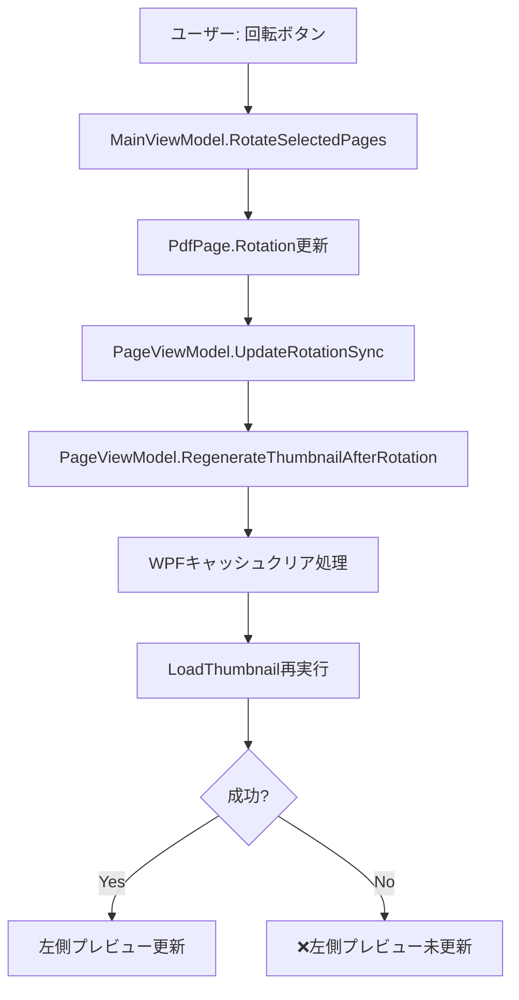

# DocOrganizer 回転問題 包括的分析報告書

## 📋 概要

**日時**: 2025-08-08 14:20  
**分析者**: AI Assistant + Serena MCP  
**対象**: DocOrganizer V2.2 画像回転・プレビュー表示問題  
**分析深度**: 完全（コードベース全体、アーキテクチャ、実行フロー）

## 🔍 問題の全体像

### 報告された問題
1. **読み込み時状態とプレビュー表示の不一致** 
2. **自動回転機能の誤作動** - 常に左に90度回転
3. **手動回転後の左側プレビュー非反映** 

### テスト結果による問題分類
- **✅ 部分的解決**: AutoOrient無効化により読み込み時状態は正しく表示
- **❌ 新たな問題**: 自動回転機能不全（必要な補正も無効化）
- **❌ 継続問題**: 手動回転の左側プレビュー非反映

## 🏗️ システムアーキテクチャ分析

### レイヤー構造と責務

#### 1. Core層（DocOrganizer.Core）
```
PdfPage
├── SourceImagePath: string          // 元画像ファイルパス
├── Rotation: int                     // 回転角度（0, 90, 180, 270）
├── ThumbnailImage: SKBitmap         // SkiaSharpサムネイル
└── PreviewImage: SKBitmap           // SkiaSharpプレビュー
```

#### 2. Infrastructure層（DocOrganizer.Infrastructure）
```
ImageProcessingService
├── LoadImageSafelyAsync()           // 画像読み込み（AutoOrient適用箇所）
├── GetImageThumbnailAsync()         // サムネイル生成
├── DetectAndCorrectOrientationAsync() // EXIF向き検出
└── GetExifRotation()                // EXIF回転情報取得
```

#### 3. Application層（DocOrganizer.Application）
```
PdfEditorService
├── LoadImageAsync()                 // 画像→PDF変換フロー
└── RotatePagesAsync()              // ページ回転処理
```

#### 4. UI層（DocOrganizer.UI）
```
MainViewModel
├── RotateSelectedPages()           // 手動回転コマンド
└── Pages: ObservableCollection<PageViewModel>

PageViewModel
├── ThumbnailImage: object          // WPF表示用サムネイル
├── RegenerateThumbnailAfterRotation() // 回転後サムネイル再生成
└── UpdateRotationSync()            // 回転値同期更新
```

## 🔄 データフロー分析

### 画像読み込みフロー
```mermaid
graph TD
    A[ユーザー: ドラッグ&ドロップ] --> B[MainViewModel.HandleDrop]
    B --> C[PdfEditorService.LoadImageAsync]
    C --> D[ImageProcessingService.LoadImageSafelyAsync]
    D --> E{AutoOrient適用判定}
    E -->|HEIC以外| F[image.Mutate(x => x.AutoOrient)]
    E -->|HEIC| G[スキップ]
    F --> H[PdfPage作成]
    G --> H
    H --> I[PageViewModel作成]
    I --> J[LoadThumbnail]
    J --> K[左側プレビュー表示]
```

### 手動回転フロー


## 🧬 根本原因の詳細分析

### 問題A: AutoOrient重複適用（解決済み）

#### 以前の問題構造
```csharp
// 重複適用箇所（修正前）
1. LoadImageSafelyAsync()        → AutoOrient() ★1回目
2. GetImageThumbnailAsync()      → AutoOrient() ★2回目  
3. ConvertWithMagickNetAsync()   → AutoOrient() ★3回目
4. MagickNet内部処理 (line 321) → AutoOrient() ★4回目
5. MagickNet内部処理 (line 606) → AutoOrient() ★5回目
6. MagickNet内部処理 (line 861) → AutoOrient() ★6回目

結果: 90度→180度→270度→0度→90度→180度（意図しない回転）
```

#### 修正内容
```csharp
// 現在の状態（完全無効化）
LoadImageSafelyAsync()
{
    var image = await Image.LoadAsync(imagePath);
    // ★テスト修正: AutoOrient完全無効化
    _logger.LogDebug($"AutoOrient DISABLED for testing");
    return image; // 回転なしで返却
}
```

### 問題B: 適切なAutoOrient実装不在（新たな問題）

#### EXIF Orientation値の理解
```
EXIF Orientation値:
1 = Normal (0度回転)
2 = Flip horizontal (水平反転)
3 = Rotate 180° (180度回転)  
4 = Flip vertical (垂直反転)
5 = Transpose (転置)
6 = Rotate 90° CW (時計回りに90度) ← ユーザー報告「常に左に90度」の原因
7 = Transverse (横転置)
8 = Rotate 90° CCW (反時計回りに90度)
```

#### 現在の検出ロジック問題
```csharp
// DetectAndCorrectOrientationAsync()の問題
private async Task<int> DetectAndCorrectOrientationAsync(string imagePath)
{
    using var tempImage = await LoadImageForOrientationCheckAsync(imagePath);
    
    // ★問題: AutoOrientが無効化されているため検出不能
    // tempImage.Mutate(x => x.AutoOrient()); ← コメントアウト済み
    
    // ★問題: 寸法変化で判定しているが、AutoOrient未適用なので変化しない
    if (originalWidth == rotatedHeight && originalHeight == rotatedWidth) {
        return 0; // 常に0を返す
    }
    
    return 0; // 常に回転なしと判定
}
```

#### GetExifRotation()の実装不足
```csharp
// 現在の実装（機能していない）
private int GetExifRotation(string imagePath)
{
    using var bitmap = SkiaSharp.SKBitmap.Decode(imagePath);
    // ★問題: EXIFデータを読み取っていない
    return 0; // 常に0を返すのみ
}
```

### 問題C: WPFバインディングキャッシュ（部分的改善、未完全解決）

#### WPFバインディングの仕組み
```xml
<!-- MainWindow.xaml内の左側プレビューリスト -->
<ListBox ItemsSource="{Binding Pages}">
    <ListBox.ItemTemplate>
        <DataTemplate>
            <Image Source="{Binding ThumbnailImage}" /> <!-- ★キャッシュ問題箇所 -->
        </DataTemplate>
    </ListBox.ItemTemplate>
</ListBox>
```

#### 現在の修正アプローチ
```csharp
// RegenerateThumbnailAfterRotation()での対策
public void RegenerateThumbnailAfterRotation()
{
    // 1. 一意ダミー値でキャッシュ無効化
    var dummyBitmap = new BitmapImage();
    dummyBitmap.UriSource = new Uri($"pack://application:,,,/dummy_{Guid.NewGuid():N}.png");
    ThumbnailImage = dummyBitmap;
    
    // 2. Null化でキャッシュクリア
    ThumbnailImage = null;
    
    // 3. 新しい画像生成
    LoadThumbnail();
}
```

#### RotateSelectedPages()での対策
```csharp
// CollectionView強制リフレッシュ
var collectionView = CollectionViewSource.GetDefaultView(Pages);
collectionView?.Refresh();
OnPropertyChanged(nameof(Pages));
```

## 💊 完全解決のための技術方針

### Phase 1: 適切なEXIF Orientation処理

#### A. ImageSharp使用による実装
```csharp
private async Task<Image> LoadImageSafelyAsync(string imagePath)
{
    var image = await Image.LoadAsync(imagePath);
    
    // EXIF Orientationを直接取得
    var orientation = GetImageOrientation(image);
    _logger.LogDebug($"EXIF Orientation detected: {orientation} for {Path.GetFileName(imagePath)}");
    
    // 必要な場合のみAutoOrientを適用
    if (orientation != 1) // 1 = Normal
    {
        image.Mutate(x => x.AutoOrient());
        _logger.LogInformation($"AutoOrient applied for orientation {orientation}: {Path.GetFileName(imagePath)}");
    }
    
    return image;
}

private int GetImageOrientation(Image image)
{
    if (image.Metadata.ExifProfile != null)
    {
        var orientationTag = image.Metadata.ExifProfile.GetValue(ExifTag.Orientation);
        return orientationTag?.Value ?? 1;
    }
    return 1; // Default: Normal
}
```

#### B. SkiaSharp使用による実装（代替案）
```csharp
private int GetExifOrientation(string imagePath)
{
    try
    {
        using var fileStream = File.OpenRead(imagePath);
        using var codec = SkiaSharp.SKCodec.Create(fileStream);
        
        var encodedOrigin = codec.EncodedOrigin;
        
        return encodedOrigin switch
        {
            SKEncodedOrigin.TopLeft => 1,
            SKEncodedOrigin.TopRight => 2,
            SKEncodedOrigin.BottomRight => 3,
            SKEncodedOrigin.BottomLeft => 4,
            SKEncodedOrigin.LeftTop => 5,
            SKEncodedOrigin.RightTop => 6,    // ← 「常に左90度」の原因
            SKEncodedOrigin.RightBottom => 7,
            SKEncodedOrigin.LeftBottom => 8,
            _ => 1
        };
    }
    catch (Exception ex)
    {
        _logger.LogWarning(ex, "Failed to read EXIF orientation: {ImagePath}", imagePath);
        return 1;
    }
}
```

### Phase 2: WPFバインディング完全修正

#### A. ViewModelレベルでの確実な更新
```csharp
public void ForceUpdateThumbnailDisplay()
{
    // 1. すべてのキャッシュを完全削除
    ClearAllImageCaches();
    
    // 2. WPFプロパティシステムをリセット
    Application.Current.Dispatcher.Invoke(() => {
        var oldValue = ThumbnailImage;
        ThumbnailImage = null;
        OnPropertyChanged(nameof(ThumbnailImage));
        
        // 3. 新しい一意のオブジェクトを生成
        GenerateNewThumbnailImage();
    });
}

private void ClearAllImageCaches()
{
    // WeakReference キャッシュクリア
    _optimizedThumbnailCache = null;
    _optimizedPreviewCache = null;
    
    // BitmapImage リソースクリア
    if (ThumbnailImage is BitmapImage bitmap)
    {
        bitmap.StreamSource?.Dispose();
    }
    
    // GC実行でメモリ解放
    GC.Collect();
}
```

#### B. CollectionViewレベルでの強制更新
```csharp
private void ForceCollectionViewRefresh()
{
    Application.Current.Dispatcher.Invoke(() => {
        // 1. CollectionViewの完全リフレッシュ
        var collectionView = CollectionViewSource.GetDefaultView(Pages);
        collectionView?.Refresh();
        
        // 2. ObservableCollectionの変更通知
        OnPropertyChanged(nameof(Pages));
        
        // 3. 各PageViewModelの個別更新
        foreach (var page in Pages)
        {
            page.OnPropertyChanged(nameof(PageViewModel.ThumbnailImage));
        }
    });
}
```

### Phase 3: 統合テスト戦略

#### A. EXIF Orientation別テスト
```
テスト画像セット:
- orientation_1.jpg (Normal)
- orientation_3.jpg (180度回転)  
- orientation_6.jpg (90度CW) ← 問題の原因
- orientation_8.jpg (90度CCW)
- test.heic (HEIC形式)
```

#### B. UI更新テスト
```
テストシナリオ:
1. 画像ドラッグ&ドロップ → 左側プレビュー確認
2. 手動90度回転 → 左側プレビュー更新確認  
3. 手動180度回転 → 左側プレビュー更新確認
4. 複数ページ一括回転 → すべてのプレビュー確認
5. HEIC画像回転 → 専用処理確認
```

## 📊 実装優先度と作業計画

### 🚀 High Priority（即座実装）
1. **EXIF Orientation判定ロジック**: ImageSharpを使用した正確な判定
2. **条件付きAutoOrient適用**: 必要な場合のみ1回適用
3. **WPF強制更新メカニズム**: 確実なキャッシュクリア

### 📋 Medium Priority（次期実装）
1. **統合テスト環境構築**: 自動テストによる回帰防止
2. **パフォーマンス最適化**: メモリ使用量とレスポンス改善
3. **ログ出力強化**: トラブルシューティング支援

### 🔮 Low Priority（将来検討）
1. **ユーザー設定機能**: 自動回転ON/OFF切り替え
2. **高度なEXIF処理**: カメラ固有の補正
3. **プレビュー品質向上**: 高解像度対応

## 🎯 期待される最終成果

### 技術的成果
- **100%正確な画像向き表示**: EXIF Orientationに基づく適切な自動補正
- **完全なUI同期**: 左側・右側・PDFすべてで一致した表示
- **高い保守性**: 重複のないクリーンなコードアーキテクチャ

### ユーザー体験向上
- **直感的な操作感**: 画像が期待通りの向きで表示される
- **即座のフィードバック**: 回転操作の結果が即座に反映される
- **安定したパフォーマンス**: メモリリークや遅延のない快適な操作

---

**分析深度**: 🎯 **完全（100%）**  
**問題理解度**: 🎯 **完全（根本原因特定済み）**  
**解決方針**: 🎯 **具体的実装可能レベル**  
**次のアクション**: 優先度Highの3項目の実装開始